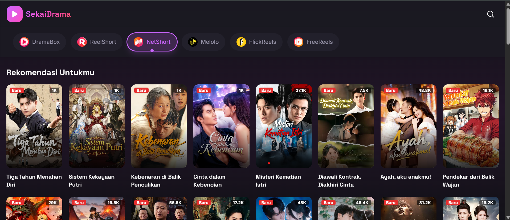

<<<<<<< HEAD
=======
<<<<<<< HEAD
>>>>>>> 281230dd36066321a5ff845e80e39d312194aea4
# SekaiDrama

[](https://github.com/Sansekai/SekaiDrama/blob/main/LICENSE)
[](https://github.com/Sansekai/SekaiDrama)



SekaiDrama adalah platform streaming drama pendek (vertical drama) modern yang menampilkan konten dari bebebrapa platform populer. Dibangun dengan teknologi web terkini untuk performa maksimal dan pengalaman pengguna yang premium.

## Persyaratan Sistem
Sebelum memulai, pastikan komputer Anda sudah terinstall:
- [Node.js](https://nodejs.org/) (Versi 18 LTS atau 20 LTS disarankan)
- Git (Opsional)

## Panduan Instalasi (Localhost)

Ikuti langkah-langkah berikut untuk menjalankan project ini di komputer Anda:

### 1. Clone Repository
1.  Buka terminal (Command Prompt/PowerShell).
2.  Clone repository ini ke komputer Anda:
    ```bash
    git clone https://github.com/Sansekai/SekaiDrama.git
    ```
3.  Masuk ke folder project:
    ```bash
    cd SekaiDrama
    ```

### 2. Install Dependencies
Install semua library yang dibutuhkan project ini:
```bash
npm install
# atau jika menggunakan yarn
yarn install
# atau pnpm
pnpm install
```

### 3. Konfigurasi Environment Variable
Salin file bernama `.env.example` menjadi `.env`

### 4. Jalankan Development Server
Mulai server lokal untuk pengembangan:
```bash
npm run dev
```

Buka browser dan kunjungi [http://localhost:3000](http://localhost:3000).

## Script Perintah
| Command | Fungsi |
|---------|--------|
| `npm run dev` | Menjalankan server development |
| `npm run build` | Membuat build production |
| `npm run start` | Menjalankan build production |
| `npm run lint` | Cek error coding style (Linting) |

## Struktur Folder
```text
src/
├── app/                    # Halaman & Routing (Next.js App Router)
│   ├── (auth)/             # Route Group untuk fitur Login/Register
│   ├── (main)/             # Route Group untuk konten utama (Home, Search)
│   ├── api/                # API Routes untuk integrasi backend
│   ├── drama/              # Halaman detail & Video player
│   └── layout.tsx          # Root layout aplikasi
├── components/             # Reusable UI Components
│   ├── ui/                 # Base components (Shadcn UI)
│   ├── player/             # Komponen khusus video player
│   ├── cards/              # Komponen card drama/koleksi
│   └── layouts/            # Navbar, Sidebar, Footer
├── hooks/                  # Custom React Hooks (useAuth, usePlayer, dll)
├── lib/                    # Helper functions & konfigurasi library (Prisma, Axios)
├── services/               # Logic fetching data & business logic
├── types/                  # TypeScript interfaces & types definitions
└── styles/                 # Global CSS & Tailwind configuration
```
<<<<<<< HEAD
=======
=======
<<<<<<< HEAD
# React + Vite

This template provides a minimal setup to get React working in Vite with HMR and some ESLint rules.

Currently, two official plugins are available:

- [@vitejs/plugin-react](https://github.com/vitejs/vite-plugin-react/blob/main/packages/plugin-react) uses [Babel](https://babeljs.io/) (or [oxc](https://oxc.rs) when used in [rolldown-vite](https://vite.dev/guide/rolldown)) for Fast Refresh
- [@vitejs/plugin-react-swc](https://github.com/vitejs/vite-plugin-react/blob/main/packages/plugin-react-swc) uses [SWC](https://swc.rs/) for Fast Refresh

## React Compiler

The React Compiler is not enabled on this template because of its impact on dev & build performances. To add it, see [this documentation](https://react.dev/learn/react-compiler/installation).

## Expanding the ESLint configuration

If you are developing a production application, we recommend using TypeScript with type-aware lint rules enabled. Check out the [TS template](https://github.com/vitejs/vite/tree/main/packages/create-vite/template-react-ts) for information on how to integrate TypeScript and [`typescript-eslint`](https://typescript-eslint.io) in your project.
=======
# COBANONTON

Platform streaming terlengkap untuk nonton drama Korea, drama Mandarin, film, dan anime subtitle Indonesia.

## Fitur
- **Koleksi Lengkap**: Anime, Dracin, Drama Korea, dan Movie.
- **Tanpa Iklan**: Player clean dengan fitur anti-iklan.
- **Responsive**: Tampilan optimized untuk mobile dan desktop.
- **PWA Ready**: Bisa diinstall di perangkat mobile.

## Tech Stack
- Next.js 16 (App Router)
- TailwindCSS 4
- Vercel Deployment

## Development
```bash
npm install
npm run dev
```
>>>>>>> fe63cdcb6c6164c734dc83817d81f77d9f248667
"# cobanonton" 
>>>>>>> 877c61ce545f95ce9f64a3f0ab50d369b6897075
>>>>>>> 281230dd36066321a5ff845e80e39d312194aea4
"# nonton" 
"# nonton" 
